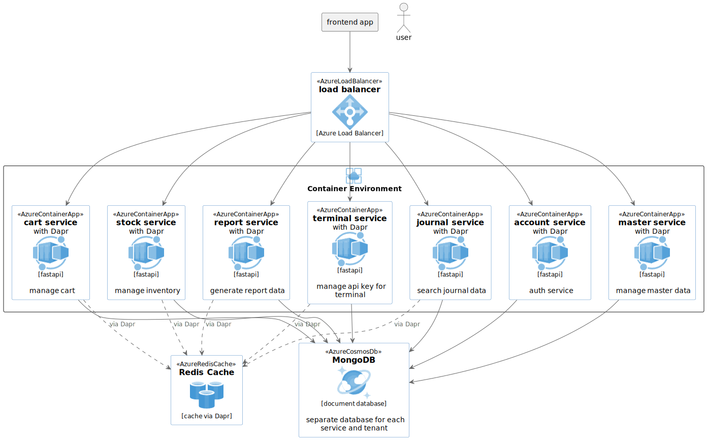

# Kugelpos - POS Backend Services

## Overview
Kugelpos is a comprehensive POS (Point of Sale) backend service designed for retail businesses. It consists of multiple microservices and features a scalable, flexible architecture.

## Features and Components
- **Account Service**: User management and authentication
- **Terminal Service**: Terminal and store management
- **Cart Service**: Product registration and transaction processing
- **Master-data Service**: Master data management
- **Report Service**: Sales report generation
- **Journal Service**: Electronic journal search
- **Stock Service**: Inventory management and stock tracking

## Architecture


## Prerequisites

For detailed installation instructions of prerequisite tools, please refer to:
- 📚 [Installation Guide (English)](install/install_doc.md)
- 🇯🇵 [Installation Guide (Japanese)](install/install_doc_ja.md)

Required tools:
- Docker and Docker Compose
- Python 3.12 or higher
- pipenv (for Python dependency management)
- MongoDB 7.0+ (automatically provided via Docker)
- Redis (automatically provided via Docker)

## Quick Start

### 1. Clone the repository
```bash
git clone https://github.com/kugel-masa/kugelpos-backend.git
cd kugelpos-backend
```

### 2. Run the quick start script
```bash
# First, add execute permission to the script
chmod +x quick_start.sh

# Then run the script which handles all setup steps automatically:
# - Builds Python environments
# - Builds Docker images
# - Starts all services
./quick_start.sh
```

### 3. Access services
- Account API: http://localhost:8000/docs
- Terminal API: http://localhost:8001/docs
- Master Data API: http://localhost:8002/docs
- Cart API: http://localhost:8003/docs
- Report API: http://localhost:8004/docs
- Journal API: http://localhost:8005/docs
- Stock API: http://localhost:8006/docs

### 4. Run tests (optional)
```bash
# Run all tests with progress display
./scripts/run_all_tests_with_progress.sh
```

### 5. Stop services
```bash
# Stop all services
./scripts/stop.sh

# Stop and clean up all data
./scripts/stop.sh --clean
```

## Manual Setup (Alternative)

If you prefer to run the setup steps manually:

### 1. Environment setup

#### Environment Variables (Optional for Development)
The services include default values for development, but you may want to customize them:

- `SECRET_KEY`: JWT signing secret key (default: "test-secret-key-for-development-only")
- `PUBSUB_NOTIFY_API_KEY`: API key for Pub/Sub notifications (has default value)

⚠️ **Important**: Change these values in production environments!

```bash
# Optional: Set custom environment variables for development
export SECRET_KEY="your-secure-secret-key-here"
export PUBSUB_NOTIFY_API_KEY="your-api-key-here"

# Prepare test environment file (only change tenant ID if needed)
cp .env.test.sample .env.test
```

### 2. Prepare scripts
```bash
# Make all script files executable
chmod +x ./scripts/make_scripts_executable.sh
./scripts/make_scripts_executable.sh
```

### 3. Setup development environment
```bash
# Build Python virtual environments
./scripts/rebuild_pipenv.sh
```

### 4. Build and start services
```bash
# Build all services
./scripts/build.sh

# Start all services
./scripts/start.sh
```

### Additional build options
```bash
# Build specific services only
./scripts/build.sh cart journal

# Build without cache
./scripts/build.sh --no-cache

# Build in parallel
./scripts/build.sh --parallel
```

## Development

### Local Development Without Docker

Each service can be run locally for development:

```bash
# Navigate to services directory
cd services

# Start only infrastructure services
docker-compose up -d mongodb redis

# Run a specific service locally (example: cart service)
cd cart
pipenv install

# Method 1: Using the run.py script (simplest)
pipenv run python run.py

# Method 2: Using uvicorn directly (for development with reload)
pipenv run uvicorn app.main:app --reload --host 0.0.0.0 --port 8003
```

Service Port Mappings:
- account: port 8000
- terminal: port 8001
- master-data: port 8002
- cart: port 8003
- report: port 8004
- journal: port 8005
- stock: port 8006

### Utility Scripts

#### Make Scripts Executable
When cloning or copying the project, you may need to restore execute permissions for shell scripts:

```bash
# Make all .sh files executable in the entire project (default)
./scripts/make_scripts_executable.sh

# Make all .sh files executable in specific directory
./scripts/make_scripts_executable.sh /path/to/directory

# Verbose mode - shows list of modified files
./scripts/make_scripts_executable.sh . -v
```

This script finds and makes executable ALL .sh files in the project, including:
- Scripts in `/scripts` directory
- Service test scripts in `/services/*/run_all_tests.sh`
- And any other .sh files in subdirectories

### Directory Structure
```
kugelpos/
├── services/
│   ├── account/    # Account management service
│   ├── terminal/   # Terminal management service
│   ├── cart/       # Cart and transaction processing service
│   ├── master-data/# Master data service
│   ├── report/     # Report generation service
│   ├── journal/    # Electronic journal service
│   ├── stock/      # Stock management service
│   ├── commons/    # Common library
│   └── dapr/       # Dapr component configuration files
├── scripts/        # Utility scripts
└── docs/           # Documentation
```

### Process Flow Overview

API calls should be made in the following order:

1. **Account Service**
   - Super user registration
   - Login (obtain token)
   - Additional user registration as needed

2. **Terminal Service**
   - Tenant information registration
   - Store registration
   - Terminal registration

3. **Master-data Service**
   - Staff master registration
   - Payment method master registration
   - Category master registration
   - Common product master registration
   - Store-specific product master registration
   - Product preset master registration

4. **Cart Service** (specifying Terminal ID and API KEY)
   - Sign in
   - Terminal open
   - Cart creation (start transaction)
   - Product registration and modification
   - Subtotal processing
   - Payment registration
   - Transaction confirmation
   - Report retrieval
   - Electronic journal search
   - Terminal close
   - Sign out

5. **Report Service**
   - Flash sales report generation
   - Daily sales report generation

6. **Journal Service**
   - Transaction journal search

## License
Apache License 2.0