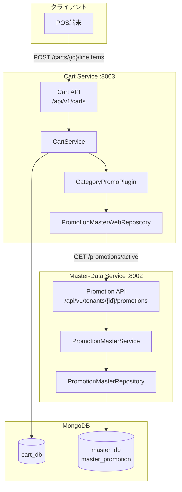
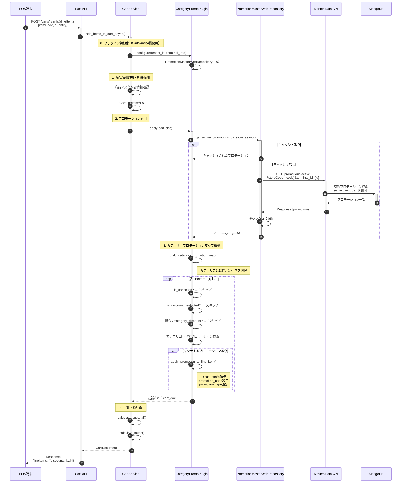
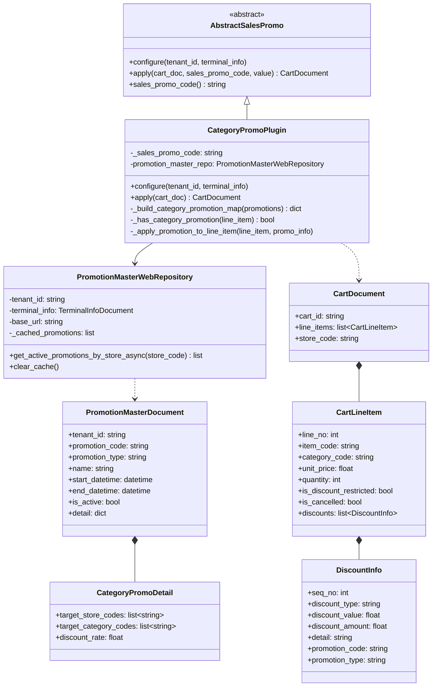
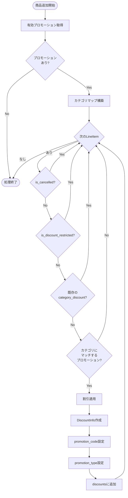
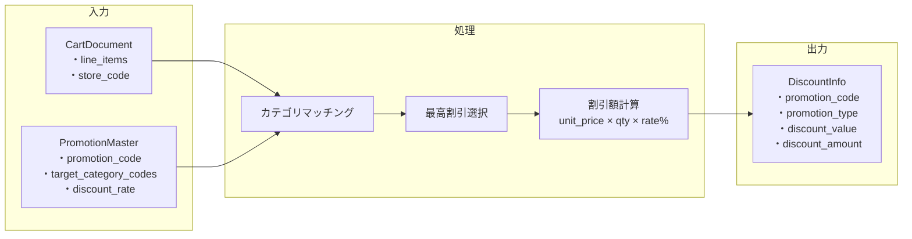
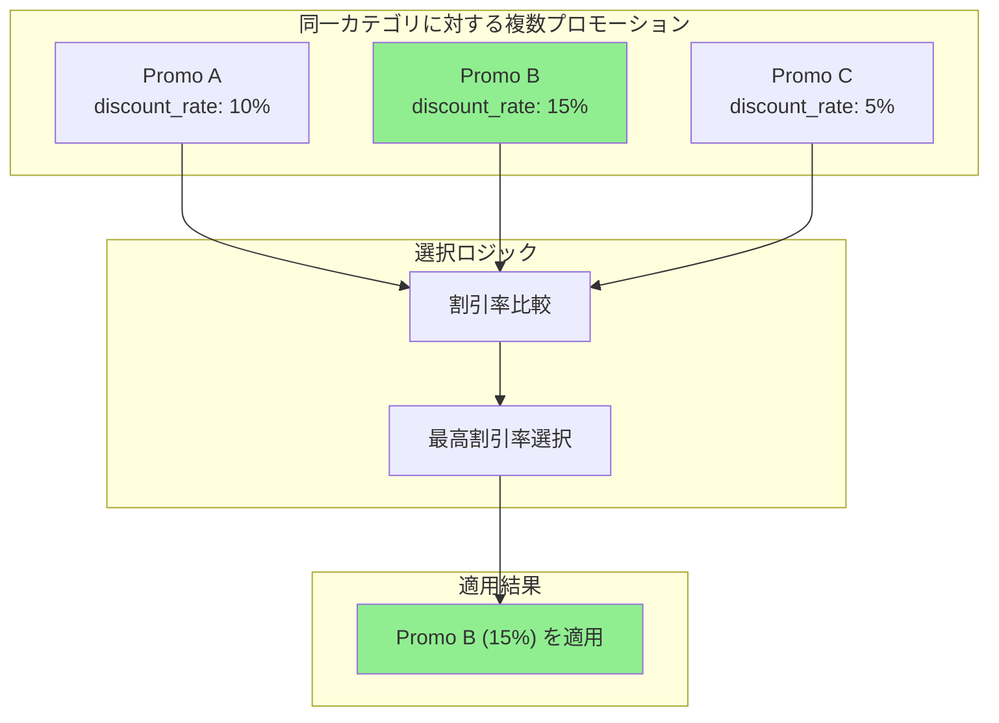
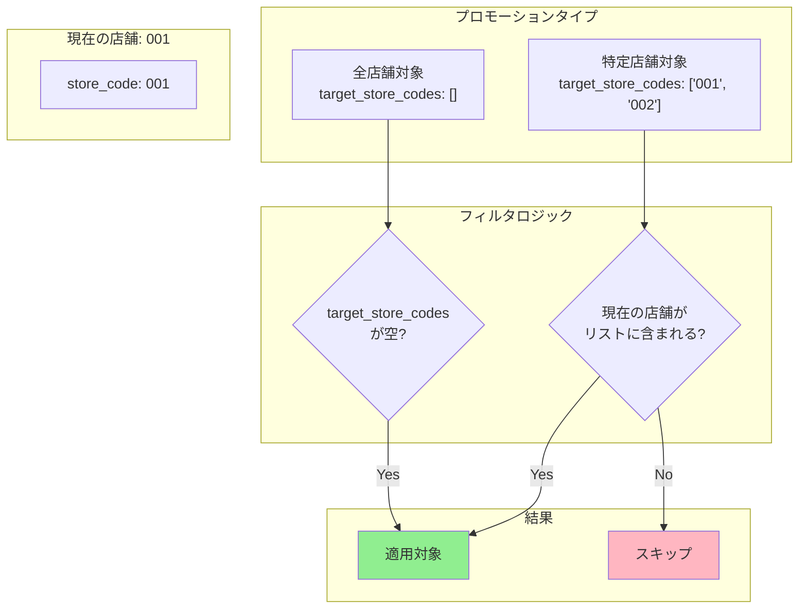
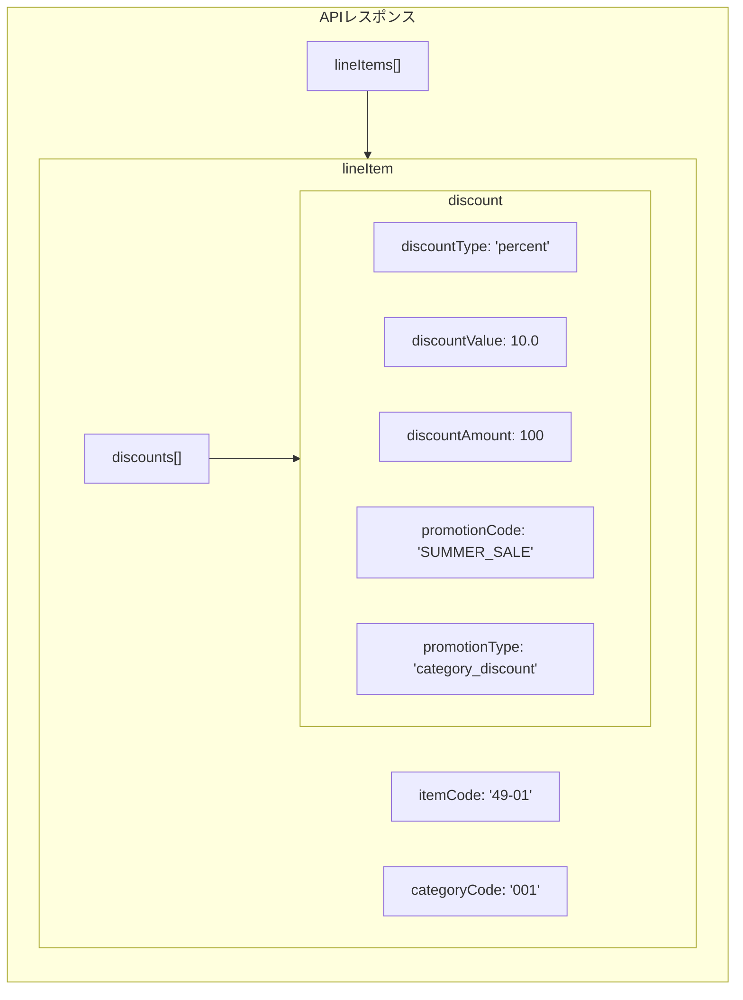

# カテゴリプロモーション機能 アーキテクチャ図

## 1. システム全体構成図

## 2. プロモーション適用シーケンス図 (必須)

## 3. クラス図

## 4. プロモーション適用判定フロー

## 5. データフロー図

## 6. 複数プロモーション時の最適選択

## 7. 店舗フィルタリング

## 8. APIレスポンス構造

---

## 関連ファイル

| コンポーネント | ファイルパス |
|---------------|-------------|
| CategoryPromoPlugin | `services/cart/app/services/strategies/sales_promo/category_promo.py` |
| PromotionMasterWebRepository | `services/cart/app/models/repositories/promotion_master_web_repository.py` |
| CartService | `services/cart/app/services/cart_service.py` |
| PromotionMasterDocument | `services/master-data/app/models/documents/promotion_master_document.py` |
| Promotion API | `services/master-data/app/api/v1/promotion_master.py` |
| プラグイン設定 | `services/cart/app/services/strategies/plugins.json` |
