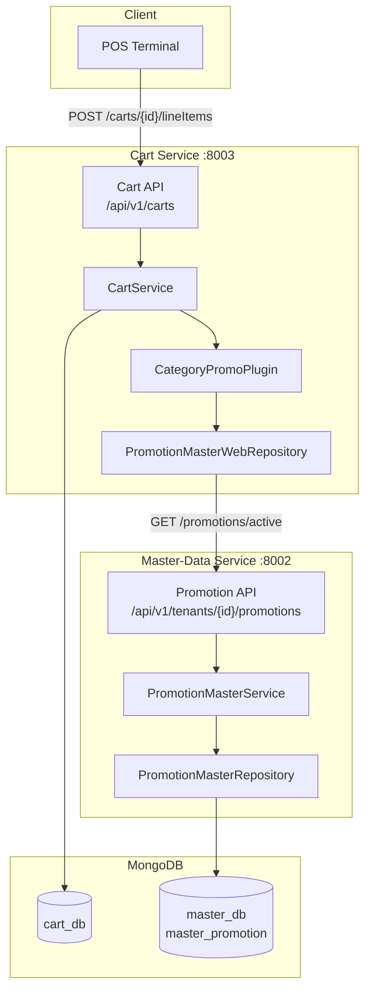
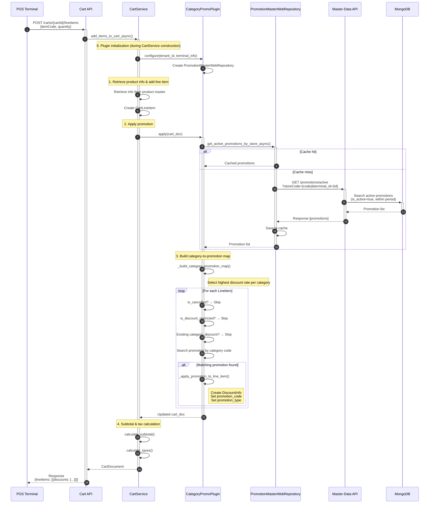
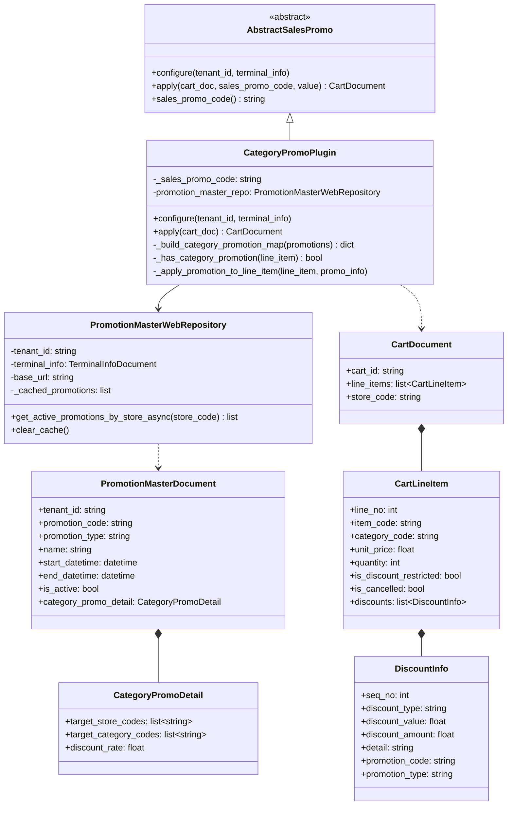
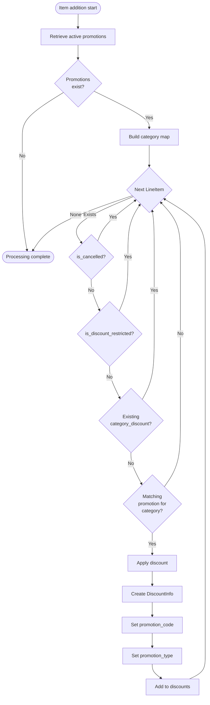
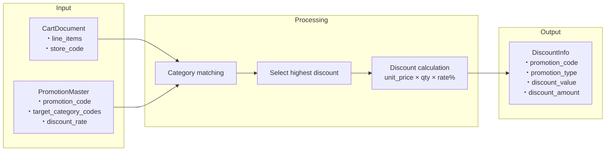
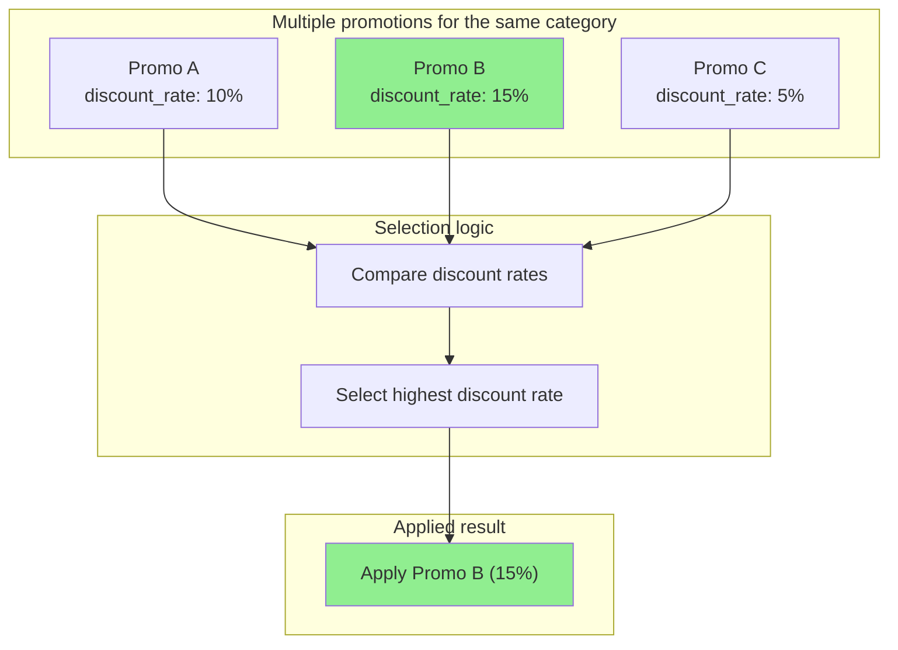
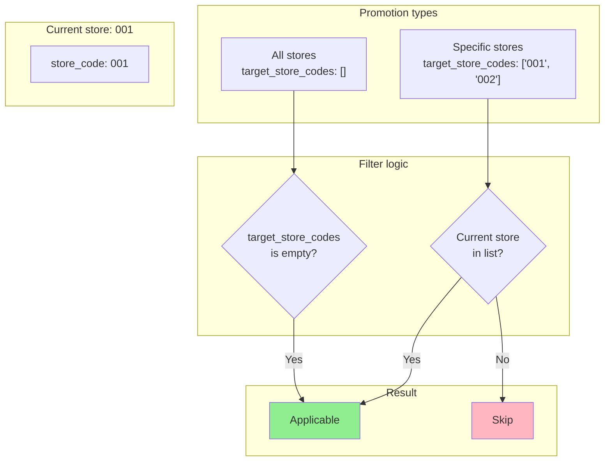
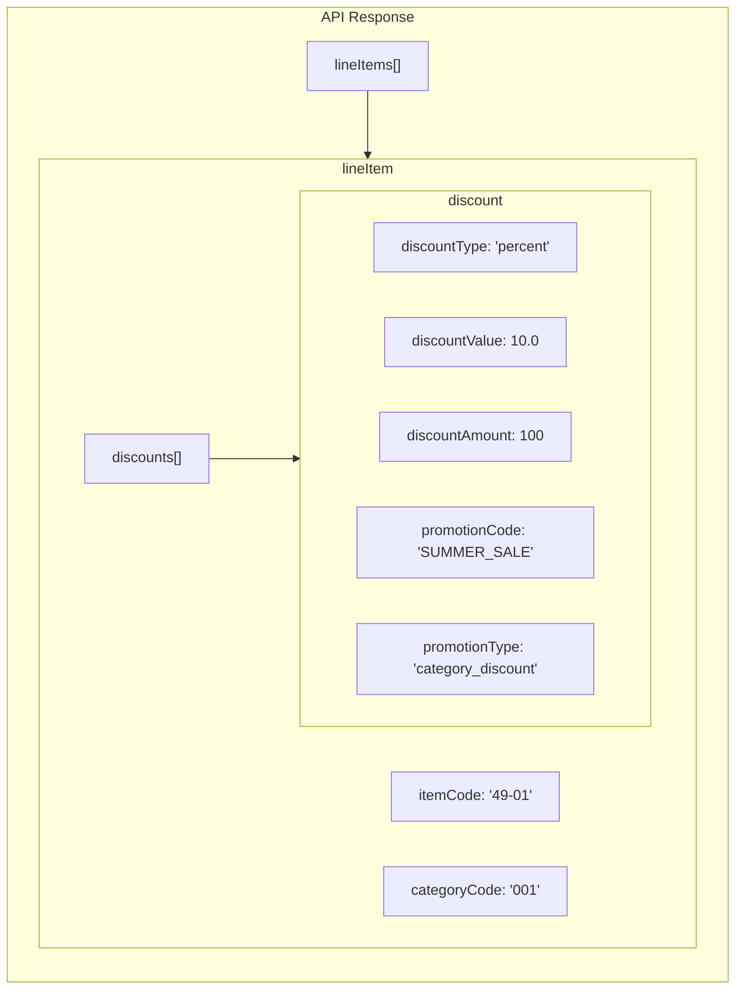

# Category Promotion Feature Architecture Diagrams

## 1. Overall System Architecture

## 2. Promotion Application Sequence Diagram (Required)

## 3. Class Diagram

## 4. Promotion Application Decision Flow

## 5. Data Flow Diagram

## 6. Optimal Selection for Multiple Promotions

## 7. Store Filtering

## 8. API Response Structure

---

## Related Files

| Component | File Path |
|-----------|-----------|
| CategoryPromoPlugin | `services/cart/app/services/strategies/sales_promo/category_promo.py` |
| PromotionMasterWebRepository | `services/cart/app/models/repositories/promotion_master_web_repository.py` |
| CartService | `services/cart/app/services/cart_service.py` |
| PromotionMasterDocument | `services/master-data/app/models/documents/promotion_master_document.py` |
| Promotion API | `services/master-data/app/api/v1/promotion_master.py` |
| Plugin configuration | `services/cart/app/services/strategies/plugins.json` |
