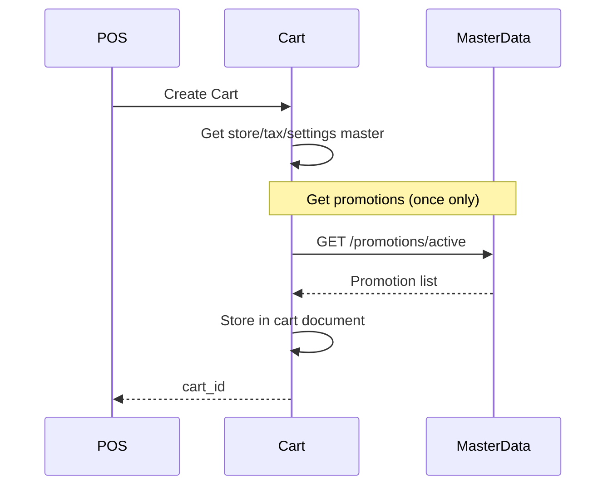
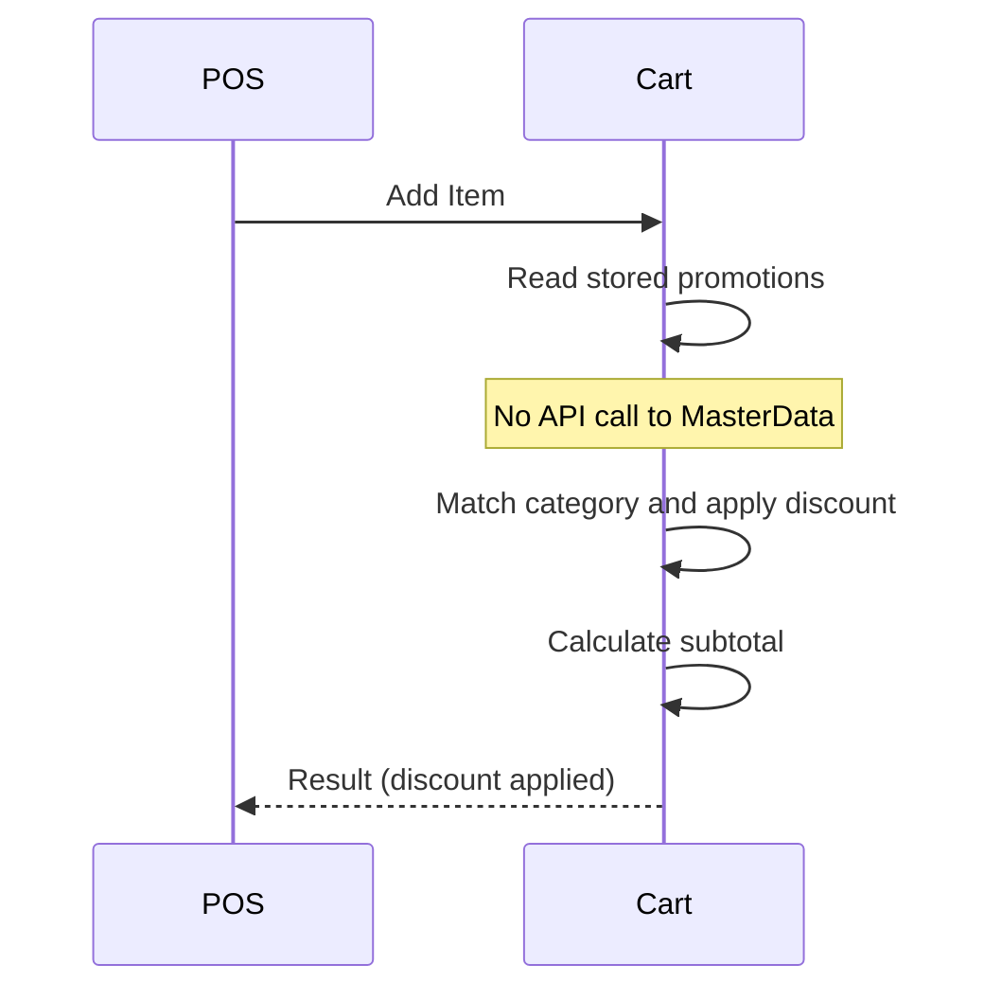
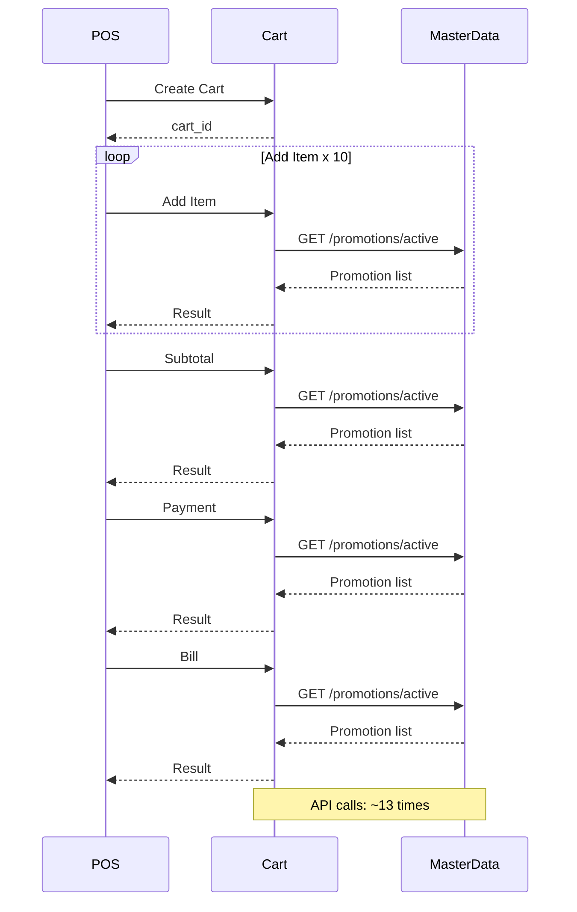
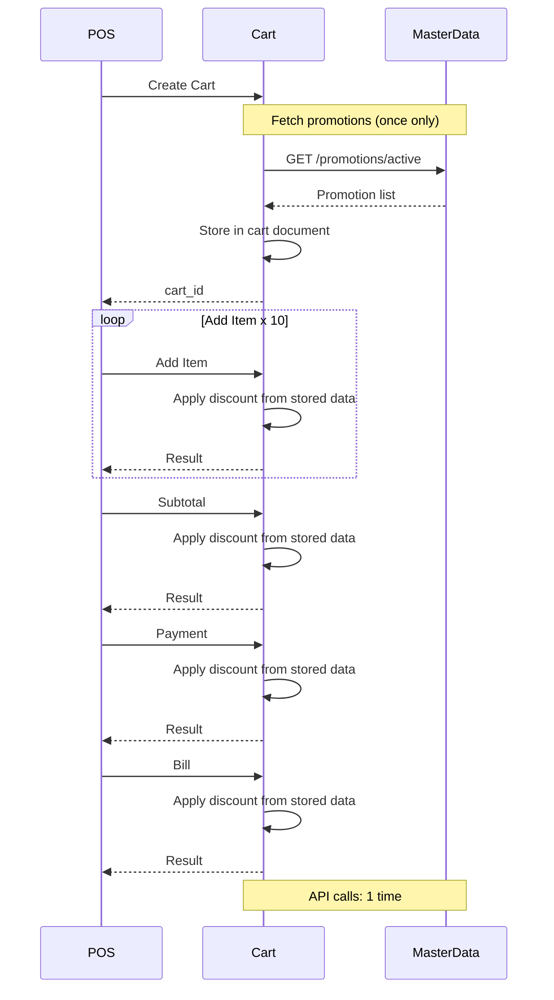

# プロモーション割引 パフォーマンス改善提案書

| 項目 | 内容 |
|------|------|
| 提案日 | 2026-03-30 |
| 対象機能 | カテゴリプロモーション（カート内自動割引適用） |
| 対象サービス | カートサービス |
| 関連サービス | マスタデータサービス |
| 対応Issue | #71 |

---

## 1. 背景

2026年3月に導入されたカテゴリプロモーション機能（#59）により、商品カテゴリに対する自動割引が可能になりました。本機能はレジ操作の都度、マスタデータサービスからプロモーション情報を取得して割引を適用する仕組みで動作しています。

運用開始後、以下の課題が確認されました。

---

## 2. 現状の課題

### 2.1 パフォーマンスへの影響

商品登録・小計・支払・精算など、**レジの操作ごとに**マスタデータサービスへのHTTP通信が発生します。

```
一般的な取引（商品10点）の場合:

  商品登録 x 10回  ->  10回のAPI通信
  小計             ->   1回のAPI通信
  支払             ->   1回のAPI通信
  精算             ->   1回のAPI通信
  ─────────────────────────────────
  合計                 約13回のAPI通信
```

すべての通信で**同じデータ（有効なプロモーション一覧）**を取得しており、通信の大半が冗長です。

### 2.2 レスポンスのばらつき

マスタデータサービスの応答速度により、商品登録ごとのレジ応答時間にばらつきが生じます。通信遅延が大きい場合、レジ操作がもたつく原因となります。

### 2.3 取引内の価格一貫性

取引の途中でプロモーション設定が変更された場合、**同一取引内で異なる割引条件が適用される可能性**があります。例えば、1品目は10%割引で登録されたのに、管理者がプロモーションを変更した直後に登録された2品目は割引なしになるケースが理論上発生し得ます。

---

## 3. 改善内容

### 3.1 基本方針

プロモーション情報を**取引開始時（カート作成時）に1回だけ取得**し、カートデータ内に保存します。以降のレジ操作では保存済みのデータを参照するため、追加の通信は発生しません。

これは、税マスタや設定マスタで既に採用している方式と同じです。

### 3.2 処理の変化

#### カート作成時



#### 商品登録時



### 3.3 取引全体の通信量比較

#### 改善前 - 10商品の取引



#### 改善後 - 10商品の取引



---

## 4. 改善効果

| 項目 | 改善前 | 改善後 |
|------|--------|--------|
| 取引あたりの通信回数 | 約15回 | **1回** |
| 取引内の割引条件 | 操作ごとに再取得（途中で変わる可能性あり） | **取引開始時に確定（一貫性を保証）** |
| 商品登録の応答速度 | マスタデータサービスの応答に依存（ばらつきあり） | **均一（通信なし）** |
| 取引開始の応答速度 | 変化なし | 微増（数十ミリ秒） |

---

## 5. 動作仕様

### 5.1 プロモーション情報の取得タイミング

- 取引開始時（カート作成時）に**1回だけ**マスタデータサービスから取得
- 取得した情報はカートデータ内に保存され、取引終了まで使用される

### 5.2 プロモーション変更の反映タイミング

- 取引途中にプロモーション設定を変更しても、**進行中の取引には影響しない**
- 変更は**次の取引開始時（次のカート作成時）** から反映される
- これにより、同一取引内の価格一貫性が保証される

### 5.3 プロモーション情報の取得に失敗した場合

| 状況 | 改善前の動作 | 改善後の動作 |
|------|-------------|-------------|
| マスタデータサービスが応答しない | 割引なしで取引を続行（顧客に不利益） | **取引開始を中止しエラーを表示** |
| レジ側の対応 | エラーに気づかない可能性あり | **リトライで復旧可能** |

改善後は、プロモーション情報を取得できない場合、**割引が適用されないまま取引が進行することを防止**します。レジはエラーを受け取り、再試行できます。

### 5.4 プロモーションが存在しない場合

プロモーションが1件も設定されていない環境でも、取引は正常に開始・完了します。

---

## 6. 影響範囲

### 6.1 レジ端末（クライアント）への影響

- **操作手順の変更: なし** - レジ操作に変更はありません
- **画面表示の変更: なし** - 割引の表示方法に変更はありません
- **エラー表示の追加: あり** - プロモーション取得失敗時に取引開始エラーが発生（従来は発生しなかった）

### 6.2 管理画面への影響

- **プロモーション管理: 変更なし** - プロモーションの作成・変更・削除の操作に変更はありません
- **反映タイミングの変化: あり** - プロモーション変更は即時ではなく、次回取引開始時に反映

### 6.3 レポートへの影響

- **変更なし** - 売上レポート・プロモーション実績レポートへの影響はありません

---

## 7. 運用上の注意事項

| 項目 | 内容 |
|------|------|
| プロモーション変更のタイミング | 進行中の取引に影響しないため、営業時間中の変更も安全に実施可能 |
| 変更反映の確認 | 新規取引を開始することで、変更後のプロモーションが適用されていることを確認可能 |
| マスタデータサービスの可用性 | 取引開始にマスタデータサービスの応答が必要。サービス停止時は新規取引が開始できない（既に開始済みの取引は影響なし） |

---

## 8. 前提条件

1. 同一取引内では、取引開始時点のプロモーション条件で全商品の売価を決定する
2. プロモーション設定の変更は、次回の取引開始から反映される
3. 営業中にプロモーション設定が変更されることは稀であり、取引途中での反映は不要とする

---

## 9. 将来の追加検討事項

本改善で取引あたりの通信を1回に削減しますが、さらなるパフォーマンス向上・信頼性強化のために以下の施策を将来的に検討できます。

### 9.1 gRPC通信対応

| 項目 | 内容 |
|------|------|
| 現状 | カートサービス → マスタデータサービス間はHTTP/REST（JSON）で通信 |
| 課題 | JSON のシリアライズ/デシリアライズのオーバーヘッド、テキストベースのため転送データ量が大きい |
| 改善案 | プロモーション取得をgRPC（Protocol Buffers）に置き換える |

**期待される効果:**

- **通信速度の向上** - Protocol Buffersのバイナリシリアライズにより、JSONと比較してデータ転送量が約50-70%削減
- **型安全性の強化** - .protoファイルによるスキーマ定義で、サービス間のI/F不整合を防止
- **既存実績** - 商品マスタ取得では既にgRPC対応済み（`ItemMasterGrpcRepository`）であり、同じパターンを適用可能

**適用イメージ:**

```
現状:   Cart --HTTP/JSON--> MasterData   (約数十ms)
改善後: Cart --gRPC/Protobuf--> MasterData (約数ms)
```

> 注: 本改善（#71）でAPI呼び出しが1回/取引に削減されるため、gRPC化の優先度は低下します。ただし、大量プロモーション（数百件）を扱う場合やネットワーク帯域が限定される環境では有効です。

### 9.2 Repository層でのインメモリキャッシュ

| 項目 | 内容 |
|------|------|
| 現状 | カート作成のたびにマスタデータサービスからプロモーション情報を取得（1回/取引） |
| 課題 | 短時間に多数の取引が開始される場合（セール開始時など）、同一データの取得が集中する |
| 改善案 | `PromotionMasterWebRepository` にTTL付きインメモリキャッシュを導入 |

**期待される効果:**

- **マスタデータサービスへの負荷軽減** - 同一店舗の複数レジが同時に取引を開始しても、キャッシュからデータを返却
- **取引開始のさらなる高速化** - キャッシュヒット時はHTTP通信が不要（サブミリ秒で応答）
- **既存実績** - ターミナル情報で同じパターンを採用済み（`terminal_cache.py`、TTL 300秒）

**適用イメージ:**

```
取引1: Cart --> Repository --> MasterData  (キャッシュMISS: API呼び出し)
取引2: Cart --> Repository                 (キャッシュHIT: API呼び出しなし)
取引3: Cart --> Repository                 (キャッシュHIT: API呼び出しなし)
  ...TTL満了...
取引N: Cart --> Repository --> MasterData  (キャッシュMISS: API呼び出し)
```

**設計上の考慮事項:**

| 考慮事項 | 対応方針 |
|---------|---------|
| キャッシュキー | `{tenant_id}:{store_code}` 単位 |
| TTL（有効期間） | 60-300秒（設定で変更可能） |
| 本改善との併用 | Repository層キャッシュ → カートドキュメント埋め込みの2層構成 |
| プロモーション変更の反映 | TTL満了後の次回取引開始時に反映（本改善の仕様と同様） |

> 注: 本改善（#71）のカートドキュメント埋め込みと競合しません。Repository層キャッシュは「マスタデータサービスへの通信頻度」をさらに削減し、カートドキュメント埋め込みは「取引内の価格一貫性」を保証します。両者は異なるレイヤーの最適化であり、組み合わせて使用できます。

### 9.3 検討事項の優先度

| 施策 | 効果 | 実装コスト | 優先度 | 推奨時期 |
|------|------|-----------|--------|---------|
| **本改善（#71）** | API呼び出し約15回 → 1回 | 低 | **実施済み** | - |
| Repository層キャッシュ | 複数取引間でのAPI呼び出し削減 | 低 | 中 | 高負荷環境での運用開始時 |
| gRPC通信対応 | 通信速度・データ量の最適化 | 中 | 低 | 大量プロモーション運用時 |

