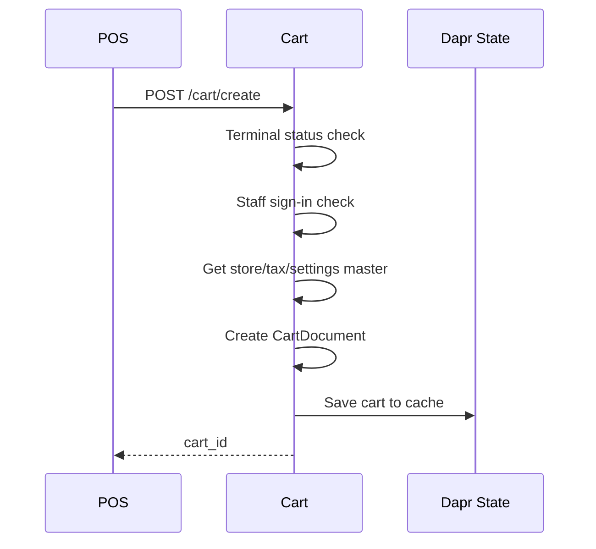
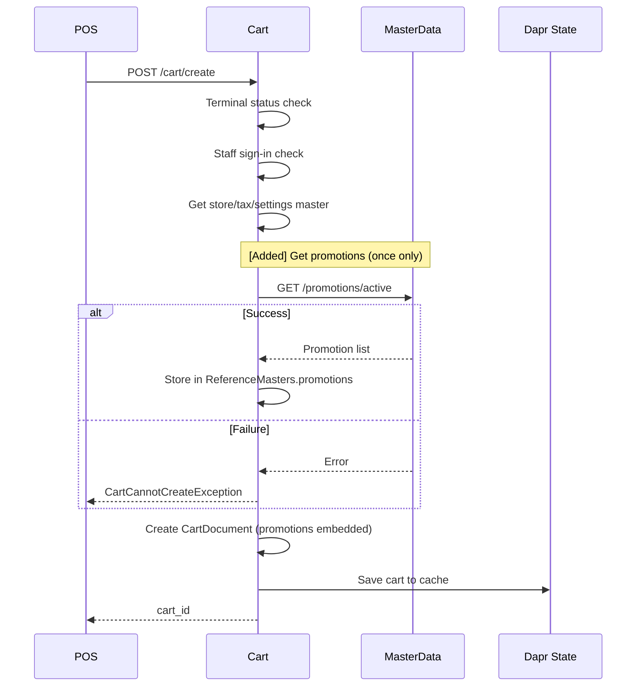
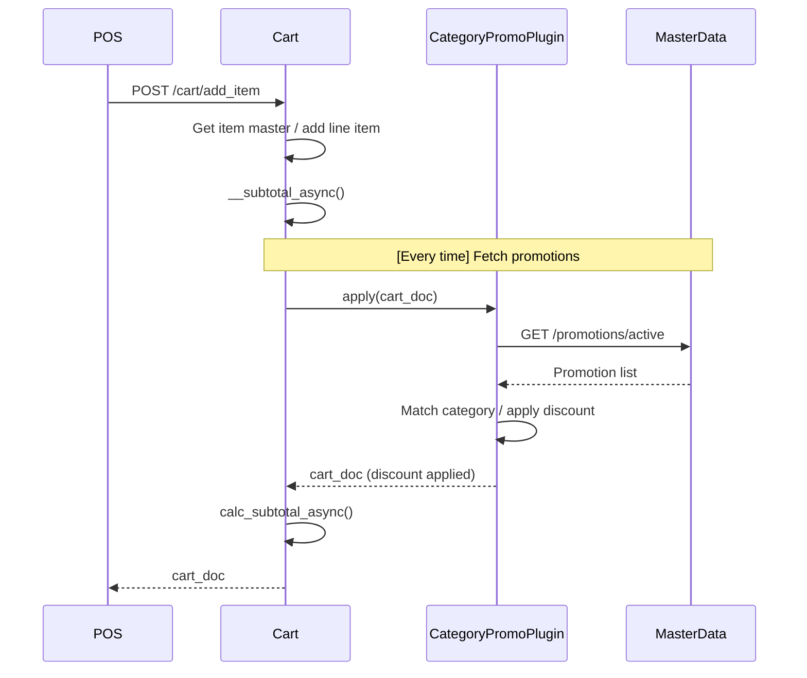
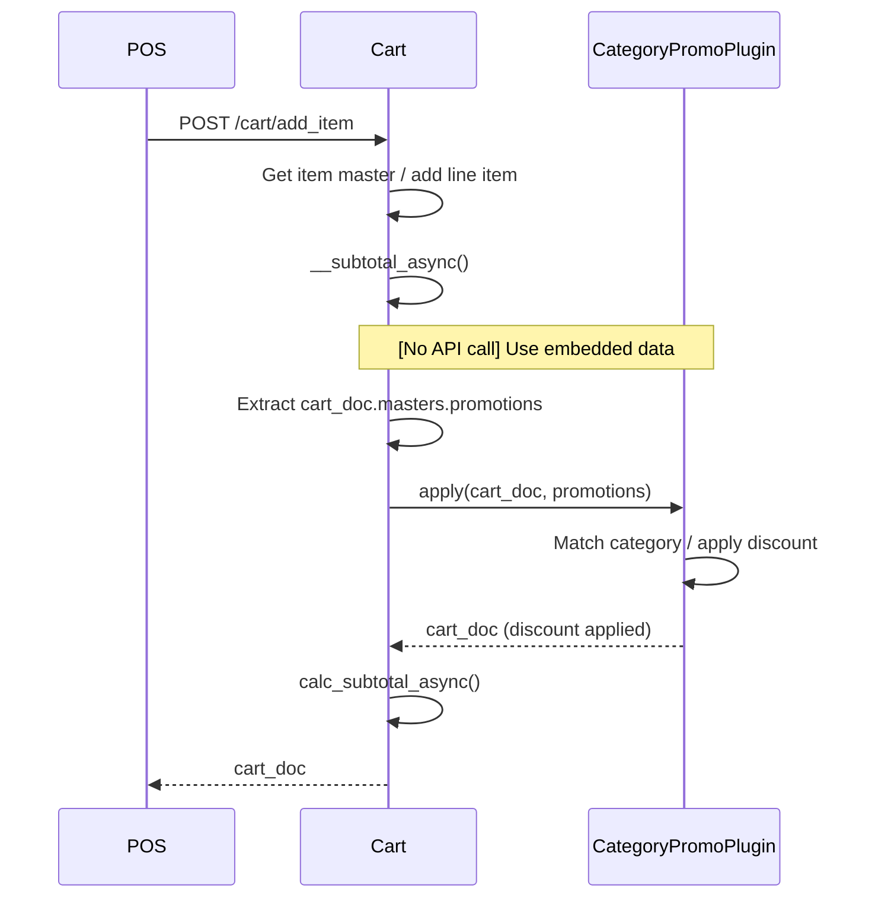
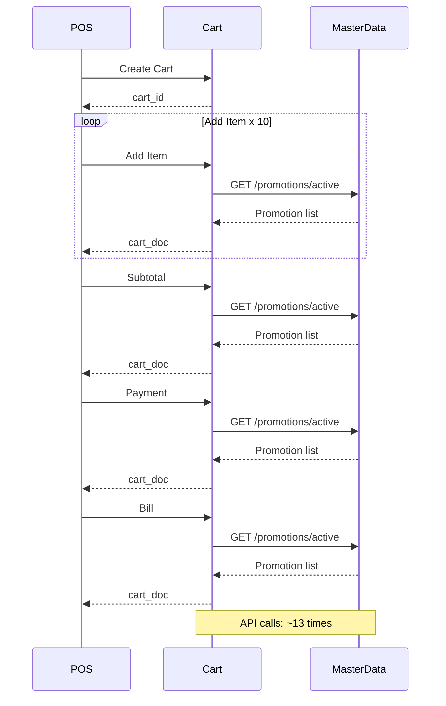
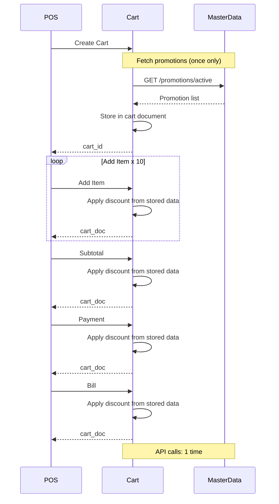

# プロモーションマスタ取得 シーケンス比較

## 1. カート作成時

### Before（変更前）

### After（変更後）

---

## 2. 商品登録時（プロモーション適用）

### Before（変更前）

### After（変更後）

---

## 3. 取引全体フロー比較

### Before（変更前）- 10商品の典型的な取引

### After（変更後）- 10商品の典型的な取引

---

## 4. 比較サマリー

| 観点 | Before | After |
|------|--------|-------|
| **プロモーション取得タイミング** | 商品登録/小計/支払/精算の各操作時 | カート作成時(1回のみ) |
| **API呼び出し回数/取引** | 約15回 | 1回 |
| **プロモーションデータの保持場所** | プラグイン内で都度取得(保持しない) | cart.masters.promotions に埋め込み |
| **プラグインの依存先** | PromotionMasterWebRepository(HTTP通信) | 引数 promotions(データのみ) |
| **取引内の価格一貫性** | 保証なし(取得タイミングでデータが異なる可能性) | 保証あり(同一スナップショットを使用) |
| **商品登録のレスポンスタイム** | API遅延に依存(ばらつきあり) | 均一(API呼び出しなし) |
| **プロモーション変更の反映** | 次の操作時に即時反映 | 次回の取引開始時(カート作成時)に反映 |
| **取得失敗時の挙動** | 空リストで続行(割引なし) | カート作成失敗(CartCannotCreateException) |
| **エラー検知タイミング** | 取引途中(商品登録時) | 取引開始前(カート作成時) |
