# Docker と Docker Compose の概要

このドキュメントでは、Kugelpos プロジェクトで使用している Docker と Docker Compose について、図を用いてわかりやすく説明します。

## 目次

- [Docker とは](#docker-とは)
- [コンテナとは](#コンテナとは)
- [Docker の利点](#docker-の利点)
- [Docker イメージとコンテナの関係](#docker-イメージとコンテナの関係)
- [Docker Compose とは](#docker-compose-とは)
- [Kugelpos での利用例](#kugelpos-での利用例)

---

## Docker とは

Docker は、アプリケーションとその依存関係を**コンテナ**という単位でパッケージ化し、どこでも同じように実行できるようにするプラットフォームです。

### 従来の開発環境との比較

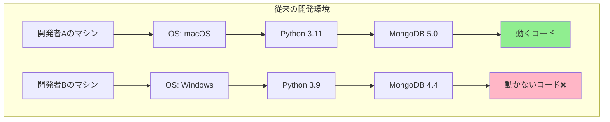

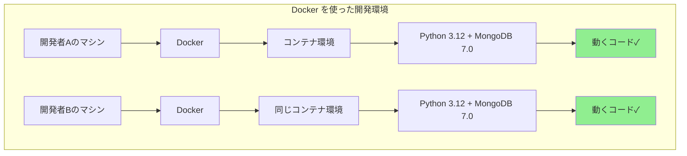

**ポイント**: どの環境でも同じコンテナを使うため、「私のマシンでは動くのに...」という問題が解決されます。

---

## コンテナとは

コンテナは、アプリケーションとその実行に必要なすべて（ライブラリ、設定ファイル、依存関係）を含む**軽量な実行環境**です。

### 仮想マシンとの比較

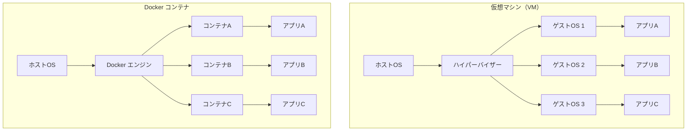

**違い:**
- **仮想マシン**: 各 VM が完全な OS を持つ（重い、起動が遅い）
- **Docker コンテナ**: ホスト OS のカーネルを共有（軽量、起動が速い）

---

## Docker の利点

### 1. 環境の一貫性


### 2. 素早いセットアップ

```mermaid
gantt
    title セットアップ時間の比較
    dateFormat X
    axisFormat %s秒

    section 手動インストール
    Python インストール: 0, 300
    MongoDB インストール: 300, 600
    依存関係インストール: 600, 900
    設定調整: 900, 1200

    section Docker
    docker compose up: 0, 60
```

### 3. クリーンな環境

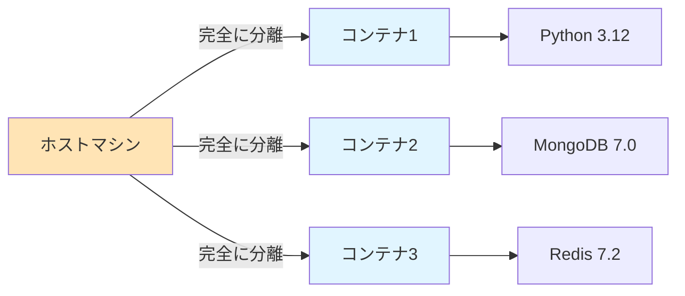

**ポイント**: ホストマシンを汚さず、コンテナを削除すれば完全にクリーンアップできます。

---

## Docker イメージとコンテナの関係

### イメージとコンテナの概念

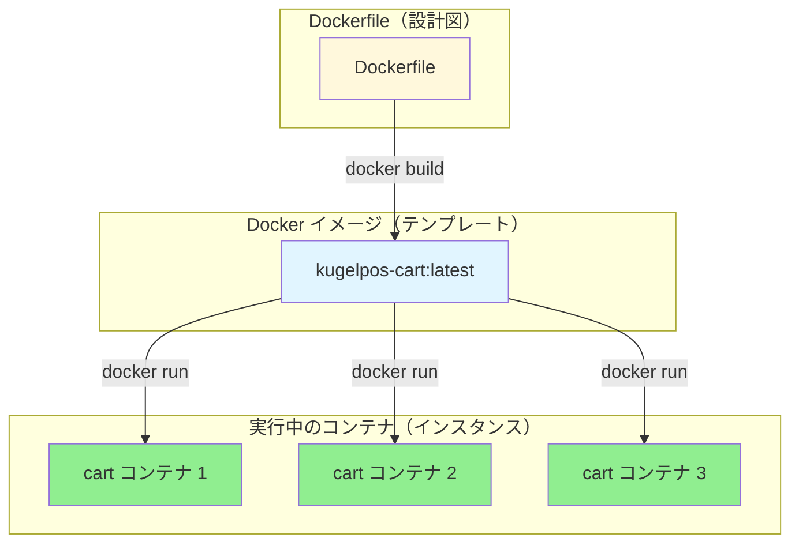

**類似例:**
- **Dockerfile** = 家の設計図
- **Docker イメージ** = プレハブ住宅のパーツ
- **コンテナ** = 実際に建てられた家

---

## Docker Compose とは

Docker Compose は、**複数のコンテナを定義・管理**するためのツールです。

### 単一コンテナ vs 複数コンテナ

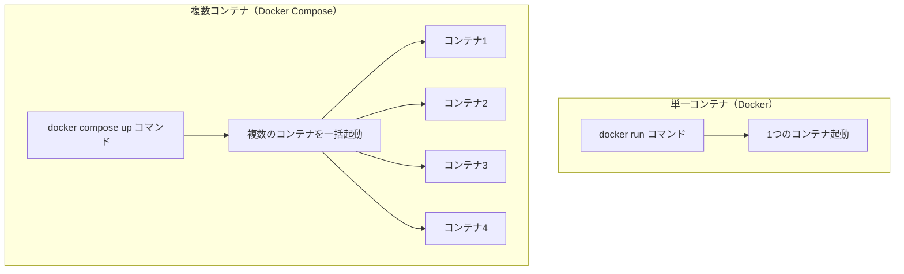

### docker-compose.yaml の役割

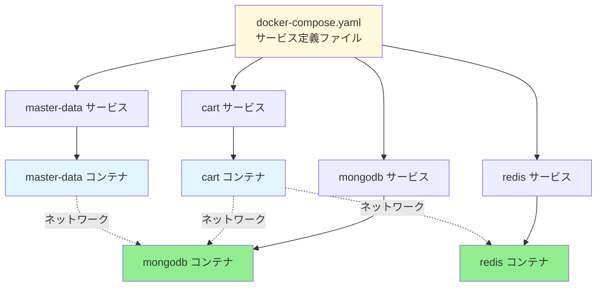

**ポイント**: docker-compose.yaml に定義するだけで、複数のコンテナとそのネットワークが自動的に構築されます。

---

## Kugelpos での利用例

### アーキテクチャ全体像

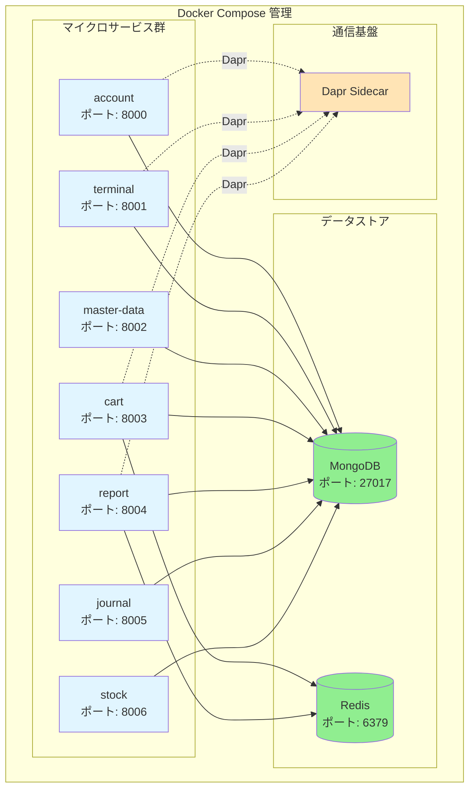

### サービス起動フロー

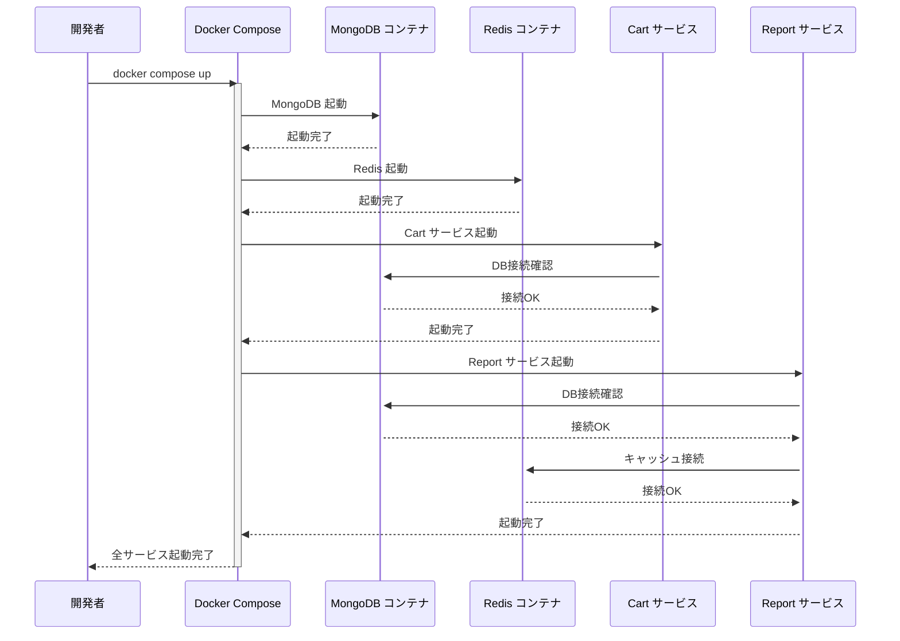

### 主要な Docker Compose コマンド

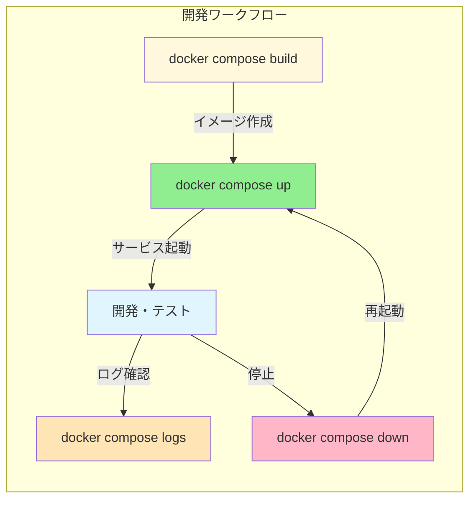

### Kugelpos での実際の使用例

```bash
# すべてのサービスをビルド
docker compose build

# すべてのサービスを起動（バックグラウンド）
docker compose up -d

# 特定のサービスのログを確認
docker compose logs -f cart

# サービスの状態を確認
docker compose ps

# 特定のサービスを再起動
docker compose restart cart

# すべてのサービスを停止・削除
docker compose down

# データも含めてすべて削除
docker compose down -v
```

---

## まとめ

### Docker の利点
- ✅ 環境の一貫性（開発・テスト・本番で同じ）
- ✅ 素早いセットアップ（数分で完全な環境構築）
- ✅ クリーンな環境（ホストマシンを汚さない）
- ✅ チーム間での環境共有が容易

### Docker Compose の利点
- ✅ 複数サービスを一括管理
- ✅ YAML ファイルで宣言的に定義
- ✅ ネットワークとボリュームを自動構築
- ✅ 簡単なコマンドで起動・停止

### Kugelpos での使い方

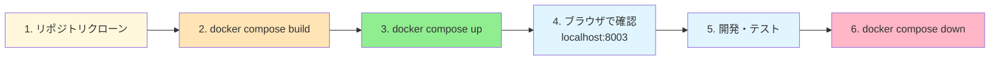

---

## 参考リンク

- Docker 公式ドキュメント: https://docs.docker.com/
- Docker Compose 公式ドキュメント: https://docs.docker.com/compose/
- Kugelpos プロジェクト CLAUDE.md: [../../CLAUDE.md](../../CLAUDE.md)

---

**最終更新**: 2025年11月30日
